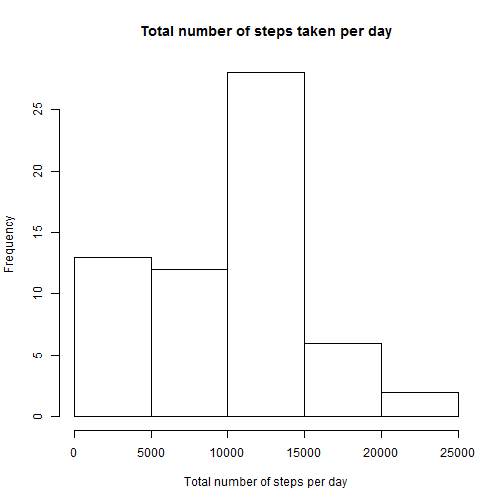
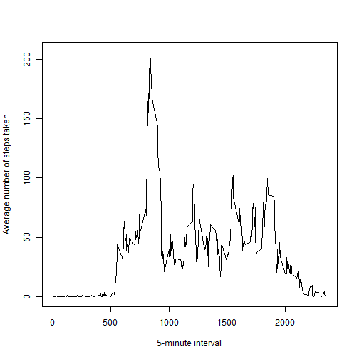
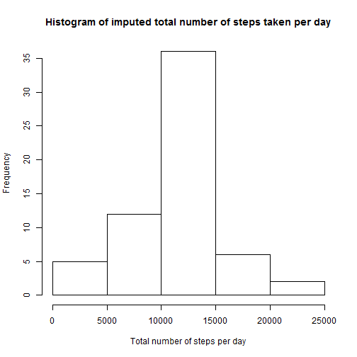
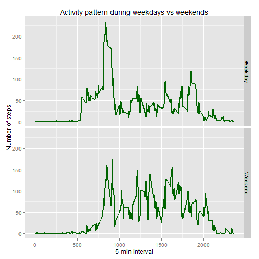

#Download data  

```r
# Reproducible Research Peer Assessment #1

# Create drectory to save data
if (!file.exists("./data")) dir.create("./data")

#Download zip file and unzip it if it is not in data folder
if (!file.exists("./data/repdata-data-activity.zip")) {
  
  fileURL <- "http://d396qusza40orc.cloudfront.net/repdata%2Fdata%2Factivity.zip"
  download.file(url = fileURL, destfile = "./data/repdata-data-activity.zip")
  
  unzip("./data/repdata-data-activity.zip", exdir = "./data")
}
```
    
#Read in data  

```r
act <- read.csv('./data/activity.csv', stringsAsFactors = F)  #17568 obs, 3 cols
act$date <-as.Date(act$date, '%Y-%m-%d')
str(act)
```

```
## 'data.frame':	17568 obs. of  3 variables:
##  $ steps   : int  NA NA NA NA NA NA NA NA NA NA ...
##  $ date    : Date, format: "2012-10-01" "2012-10-01" ...
##  $ interval: int  0 5 10 15 20 25 30 35 40 45 ...
```

```r
head(act)
```

```
##   steps       date interval
## 1    NA 2012-10-01        0
## 2    NA 2012-10-01        5
## 3    NA 2012-10-01       10
## 4    NA 2012-10-01       15
## 5    NA 2012-10-01       20
## 6    NA 2012-10-01       25
```

```r
tail(act)
```

```
##       steps       date interval
## 17563    NA 2012-11-30     2330
## 17564    NA 2012-11-30     2335
## 17565    NA 2012-11-30     2340
## 17566    NA 2012-11-30     2345
## 17567    NA 2012-11-30     2350
## 17568    NA 2012-11-30     2355
```
    
##Q1: What is mean total number of steps taken per day?

```r
steps_per_day <- aggregate(x = act$steps, by = list(date = act$date), FUN = sum, na.rm = T)
hist(steps_per_day$x, xlab = 'Total number of steps per day', main = 'Total number of steps taken per day')
```

 


```r
mean = round(mean(steps_per_day$x),2)
median = median(steps_per_day$x)
```
The mean and median of total number of steps taken per day are 9354.23 and 10395 respectively.  
    
##Q2: What is the average daily activity pattern?  

```r
steps_per_int <- aggregate(act$steps, by = list(Interval = act$interval), FUN = mean, na.rm = T)
Interval_Max = with(steps_per_int, Interval[x == max(x)])
plot(steps_per_int$Interval, steps_per_int$x, xlab = '5-minute interval', ylab = 'Average number of steps taken', type = 'l')
abline(v = Interval_Max, col ='blue')
```

 

The number of steps peaks at the 835-min interval. People were more active around 8:30 am.  
    
##Q3: Imputing missing values 

```r
steps_miss <- sum(is.na(act$steps))
```
There are 2304 missing values in the dataset.   

    
The following code uses the mean of 5-min interval to impute number of steps missing in that interval:

```r
library(sqldf)
act_impute <- sqldf('select case when a.steps is null then b.x
                                 else a.steps end as steps_imp,
                    a.date, a.interval, b.x
                    from act a left join steps_per_int b on a.interval = b.Interval')
str(act_impute)
```

```
## 'data.frame':	17568 obs. of  4 variables:
##  $ steps_imp: num  1.717 0.3396 0.1321 0.1509 0.0755 ...
##  $ date     : Date, format: "2012-10-01" "2012-10-01" ...
##  $ interval : int  0 5 10 15 20 25 30 35 40 45 ...
##  $ x        : num  1.717 0.3396 0.1321 0.1509 0.0755 ...
```

```r
#Total number of steps taken each day
steps_per_day <- with(act_impute, aggregate(steps_imp, by = list(date = date), FUN = sum))

#Histogram
hist(steps_per_day$x, xlab = 'Total number of steps per day', main = 'Histogram of imputed total number of steps taken per day')
```

 

```r
#Mean and median of total number of steps taken each day
options(scipen=999)
mean = round(mean(steps_per_day$x), digits = 0)
median = round(median(steps_per_day$x), digits =0)
```
The mean and median of total number of steps taken per day are both equal to 10766. Imputing the missing values with the mean per interval makes the mean and median closer to each other, i.e. distribution more symmetric.
    
    
##Q4: Are there differences in activity patterns between weekdays and weekends?


```r
#Weekend/weekday indicator
act$wkend <- ifelse(weekdays(act$date, abbreviate = T) %in% c('Sat', 'Sun'), 'Weekend', 'Weekday')
table(act$wkend, weekdays(act$date, abbreviate = T))
```

```
##          
##            Fri  Mon  Sat  Sun  Thu  Tue  Wed
##   Weekday 2592 2592    0    0 2592 2592 2592
##   Weekend    0    0 2304 2304    0    0    0
```

```r
#Average # steps per interval over all weekday days and all weekend days
steps_per_int <- aggregate(steps ~ wkend + interval, data = act, FUN = "mean", na.rm = T)

#Stacking time series plot
library(ggplot2)
g <- ggplot(data = steps_per_int, aes(x = interval, y = steps))
g + geom_line(color = 'dark green', size = 1) +
  facet_grid(wkend ~.) +
  labs(x ='5-min interval', y = 'Number of steps', 
       title = 'Activity pattern during weekdays vs weekends')
```

 
